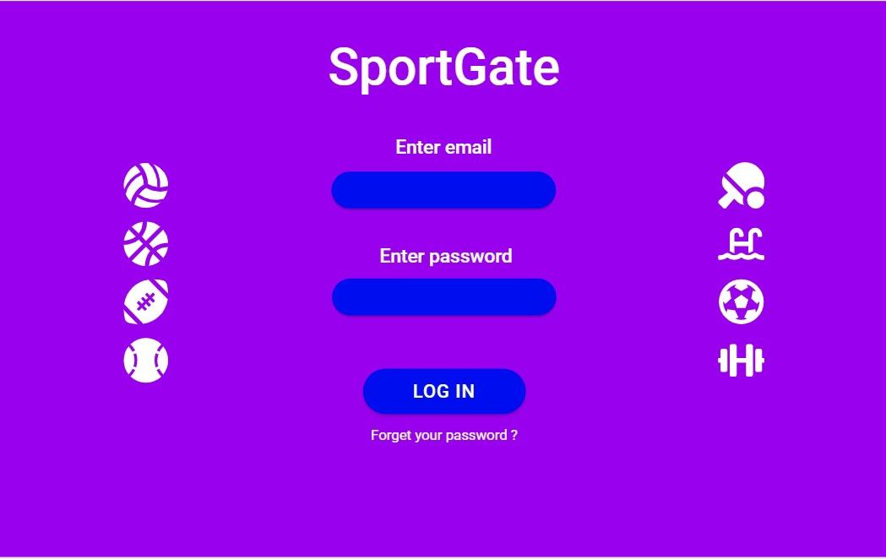
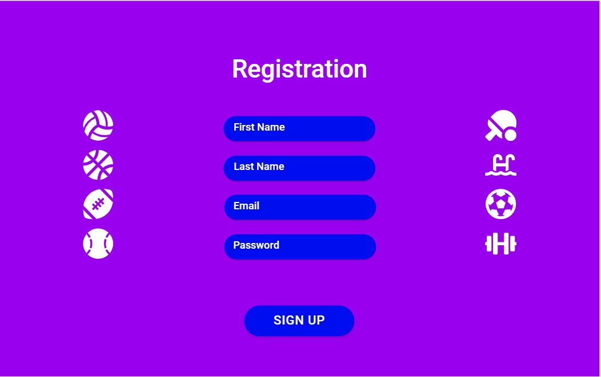
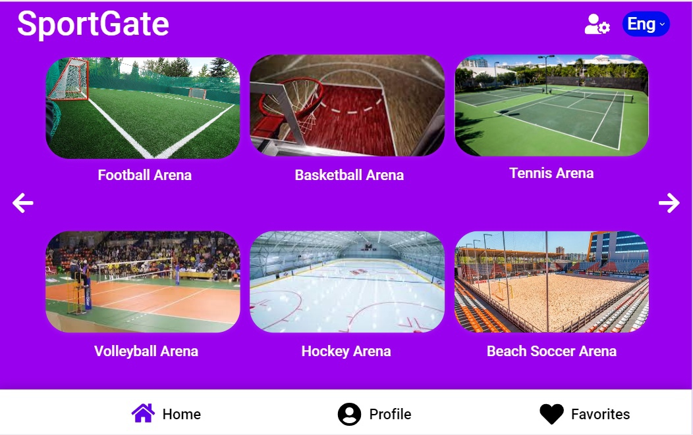
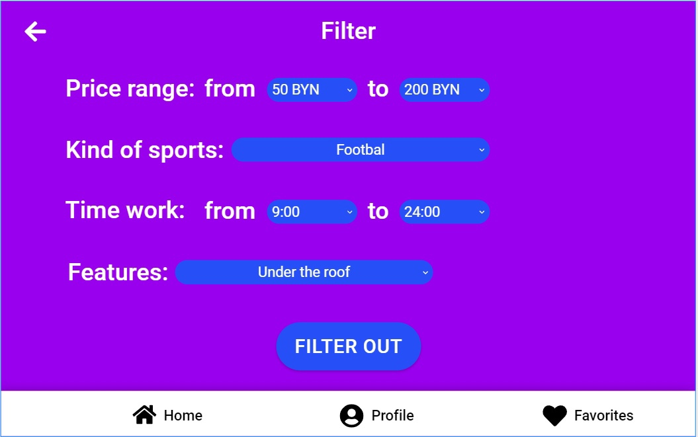
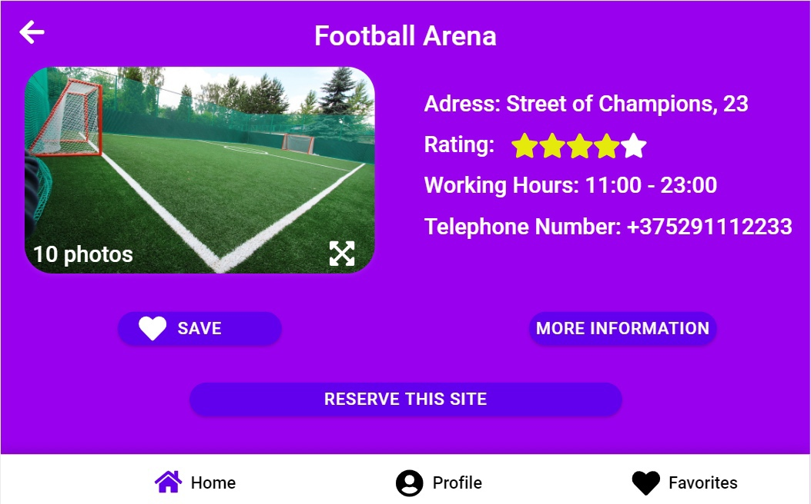
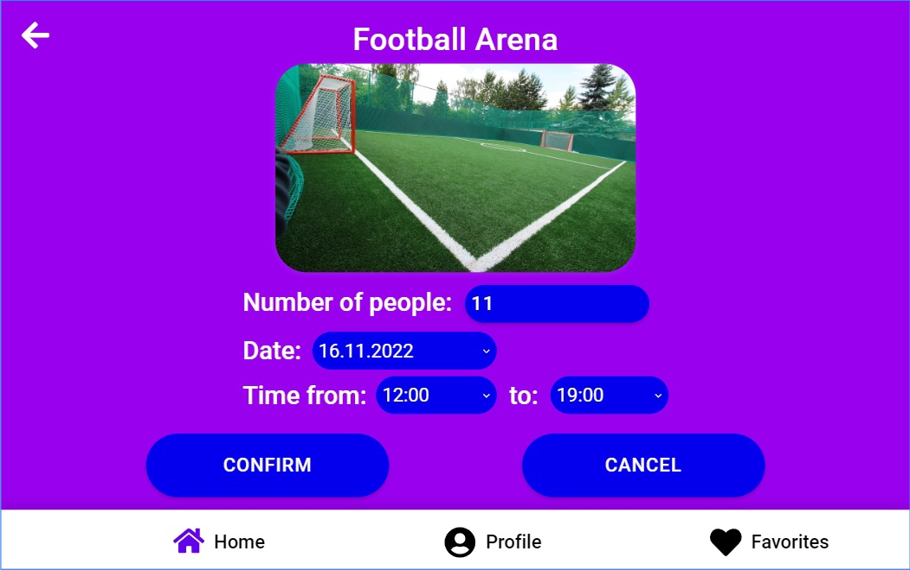
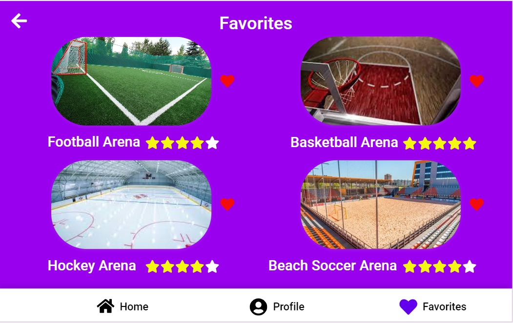

# Требования к проекту

# Содержание
1 [Введение](#intro)    
2 [Требования пользователя](#user_requirements)  
  2.1 [Программные интерфейсы](#software_interfaces)  
  2.2 [Интерфейс пользователя](#user_interface)  
  2.3 [Характеристики пользователей](#user_specifications)                                                                                           
     2.3.1 [Классификация пользователей](#user_classification)                                                                                         
     2.3.2 [Целевая аудитория](#users)                                                                                                                      
 3 [Системные требования](#system_requirements)  
  3.1 [Функциональные требования](#functional_requirements)    
  3.2 [Программные требования](#software_requirements)  

<a name="intro"/>

# 1 Введение

Название - "SportGate".

Целью проекта является разработка web-приложения с простым функционалом для обеспечения возможности просмотра и бронирования спортивных площадок по различным видам спорта. Приложение «SportGate» позволит зарегистрированным пользователям просматривать информацию о спортивных площадках, выполнять поиск мест по указанным критериям (ценовой диапазон, вид спорта, время работы), забронировать место, добавить площадку в раздел "Избранное".

<a name="user_requirements"/>

# 2 Требования пользователя

<a name="software_interfaces"/>

## 2.1 Программные интерфейсы

Продукт должен иметь user-friendly интерфейс. Приложение должно быть реализовано с использованием таких технологий, как HTML, CSS, JS and PHP, для хранения данных пользователя должен использоваться phpMyAdmin. Пользователь должен иметь возможность сменить язык приложения.

<a name="user_interface"/>

## 2.2 Интерфейс пользователя
Окно входа в приложение.  
Для бронирования различных спортивных площадок пользователь должен войти в приложение, указав свой email и password.

Окно регистрации нового пользователя.
Для создания профиля в приложении необходимо пройти процедуру регистрации, заполнив такие поля, как FirstName, LastName, email и password. Для подтверждения регистрации на email пользователя придёт ссылка, перейдя по которой пользователь успешно завершит процедуру регистрации и окажется на главной странице приложения.   

  

Главное окно приложения. 
На главной странице приложения должны отображаться спортивные площадки по различным видам спорта. 
  

Окно фильтрации спортивных площадок по параметрам. 
В данном окне пользователь может найти спортивную площадку, указав различные параметры. 
  

Окно страницы спортивной площадки. 
На данной странице должна содержаться информация о конкретной спортивной площадке.
  

Окно бронирования спортивной площадки.  
В данном окне пользователь может забронировать конкретную спортивную площадку, с указанием даты, времени, количества людей.
  

Окно сохраненных спортивных площадок.  
В данном окне должны отображаться спортивные площадки, понравившиеся пользователю.
  

<a name="user_specifications"/>

## 2.3 Характеристики пользователей

<a name="user_classification"/>

####  2.3.1  Классификация пользователей

| Класс пользователей | Описание |
|:---|:---|
| Незарегистрированные пользователи | Пользователи, которые не вошли в приложение, имеют возможность лишь просматривать информацию о различных спортивных площадках. |
| Зарегистрированные пользователи | Пользователи, которые вошли в приложение, имеют возможность забронировать спортивную площадку, добавить площадку в раздел "Избранное", искать места по определённым критериям (цена, вид спорта, время работы). |

<a name="users"/>

####  2.3.2  Целевая аудитория

Данным приложением могут пользоваться люди различных возрастных групп, которые заинтересованы в бронировании спортивных площадок.

<a name="system_requirements"/>

# 3 Системные требования

<a name="functional_requirements"/>

## 3.1 Функциональные требования

Должны быть реализованы следующие возможности:
1. Регистрация новых пользователей
2. Вход зарегистрированных пользователей в приложение
3. Бронирование спортивных площадок
4. Смена языка приложения
5. Поиск мест по ценовому диапазону, виду спорта, времени работы.
6. Добавление спортивных площадок в раздел "Избранное".

<a name="software_requirements"/>

## 3.2 Программные требования

1. PHP 8.0 и выше.
2. HTML5, CSS3, JavaScript ES6 и выше.
3. Для хранения данных пользователя используется phpMyAdmin.
4. Запросы в БД осуществляются с помощью MySQL.
5. Поддерживаемые браузеры: Google Chrome версии 96.0 и выше, Mozilla Firefox версии 98.0 и выше, Opera версии 70.0 и выше, Microsoft Edge версии 100 и выше.

